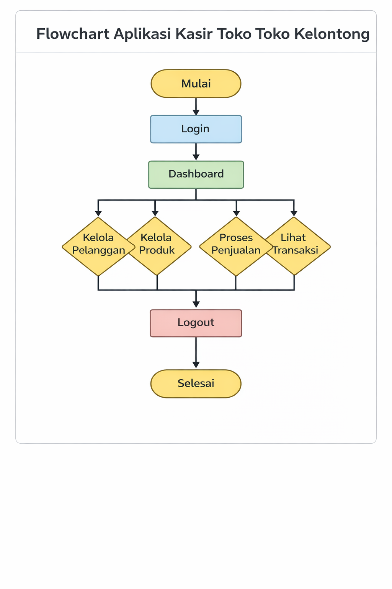

# Nama Aplikasi

**Aplikasi Kasir Toko Kelontong**

---

## Kegunaan Aplikasi

Aplikasi Kasir Toko Kelontong merupakan aplikasi berbasis web yang digunakan untuk membantu proses pengelolaan penjualan pada toko kelontong. Aplikasi ini dibuat menggunakan framework **Flask** dan database **MySQL**.

Aplikasi ini berfungsi untuk:
- Mengelola data produk
- Mengelola data pelanggan
- Melakukan transaksi penjualan
- Menyimpan dan menampilkan riwayat transaksi
- Membantu kasir dalam proses pencatatan penjualan agar lebih cepat, rapi, dan terstruktur

---

## Flowchart

Berikut adalah flowchart alur kerja Aplikasi Kasir Toko Kelontong:



---

## Perkenalan Anggota Kelompok

- **Salvano Afgan Viansyah** (2313010523)  
- **Panji Ashar Gemilang** (2313010510)  
- **Sabilah Wisnu Gumelar** (2313010519)  
- **Firman Firdaus** (2313010542)

---

## Database

- Database : `toko_kelontong`
- File database : `database/toko_kelontong.sql`

### Cara Import Database
1. Buka phpMyAdmin
2. Buat database dengan nama `toko_kelontong`
3. Pilih menu **Import**
4. Pilih file `database/toko_kelontong.sql`
5. Klik **Go**

---

## Cara Menjalankan Aplikasi

1. Install dependency:
```bash
pip install -r requirements.txt
